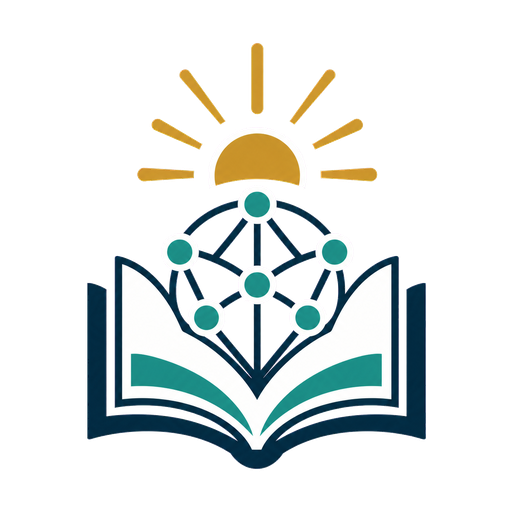

# ConectaDerechos TIC

**Gestión del conocimiento, felicidad y ciudadanía**

ConectaDerechos TIC es un libro educativo interactivo para aprender sobre la Constitución Política de Colombia, los derechos fundamentales y la ciudadanía mediante experiencias digitales progresivas.

## Experiencia educativa

- Tres unidades de aprendizaje con teoría y actividades interactivas.
- Progreso secuencial y desbloqueo por cumplimiento.
- Evaluación final con retroalimentación.
- Diseño adaptable para computador, tableta y celular.
- Recursos visuales y audiovisuales para apoyar el aprendizaje.

## Instituciones participantes

- Universidad Pedagógica y Tecnológica de Colombia, UPTC.
- Licenciatura en Informática.
- Grupo de Investigación Ambientes Virtuales Educativos, AVE.

## Abrir el proyecto

[Visitar ConectaDerechos TIC](https://liposex56.github.io/la-constitucion/)
